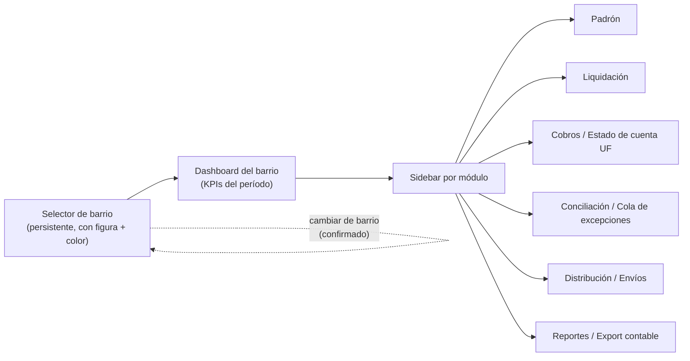
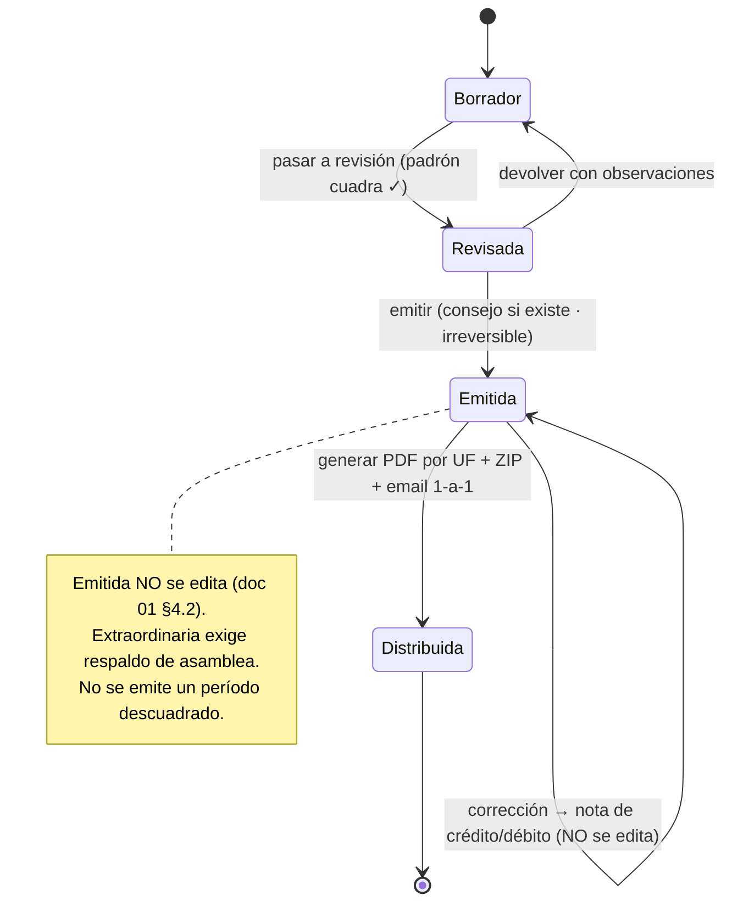

# 06 — Dirección visual

> **Fase 6B — diseño de producto (no implementación).** Este documento define la **dirección visual y de interacción** de `admin-barrios`: principios, design-tokens, arquitectura de navegación, wireframes de las pantallas clave, patrones, accesibilidad y la regla de construcción para la Fase 6C. No es código de UI ni definición de reglas de negocio; es el contrato visual que la construcción debe respetar.
>
> **Insumos.** ADR-0000 §2.1 (design-tokens neutrales en `packages/design-tokens/tokens.ts` — objetos TS que viajan a web/CSS Modules y a mobile/StyleSheet); [`01-alcance-modulos.md`](01-alcance-modulos.md) (módulos del MVP, dos caras admin-web / residente-mobile, multi-figura); [`03-modelo-datos.md`](03-modelo-datos.md) (estados de liquidación `borrador→revisada→emitida→distribuida`, KPIs, multi-tenant por barrio).
>
> **Miradas incorporadas.** `frontend-dev` (factibilidad concreta con React/Next App Router + CSS Modules + tokens) marcada con **[fe]**; `product-owner` (foco en valor y corte MVP) marcada con **[po]**. La autoría de UX/interacción/tokens es de esta persona; lo legal/fiscal no se decide acá.

---

## a. Principios de diseño

Siete principios. Todo lo demás (tokens, patrones, wireframes) es la consecuencia operativa de estos.

1. **Claridad sobre densidad.** El administrador maneja plata ajena; una pantalla saturada esconde errores caros. Preferimos jerarquía fuerte, aire (espaciado generoso) y "una decisión por vista" antes que grillas apretadas estilo ERP. La densidad se ofrece **bajo demanda** (modo compacto en tablas), nunca como default.

2. **Cada número lleva su origen — regla dura del proyecto.** Ninguna cifra de dinero aparece suelta. Toda cifra es un componente `CifraTrazable` que, al hover/focus/tap, expone **barrio + unidad funcional + concepto + coeficiente aplicado + período**. Un monto sin esos cinco datos disponibles es un bug de diseño, no una decisión estética. (Ver patrón en §e y regla dura CLAUDE.md §1.4 / doc 01 §3.2.)

3. **La nomenclatura es del barrio, no del sistema.** En un PH la etiqueta es **"Expensas"**; en un barrio-SA son **"Aportes / cuotas sociales"** (doc 01 §2.1, §3.3). Ningún texto de concepto se hardcodea: la copy de conceptos y el sustantivo de cobro salen de la config del barrio (`denominacion_segun_figura`). La UI **lee la figura antes de rotular**.

4. **Cero jerga contable en la cara del residente.** La app mobile (residente-primero) habla en criollo: "lo que tenés que pagar", "vencimiento", "cómo se calcula". IIBB, clasificación fiscal, alcanzado/no alcanzado y demás viven **solo** en la cara del administrador. Misma fuente de datos, dos registros de lenguaje.

5. **La acción principal siempre visible.** Cada pantalla tiene un CTA primario inequívoco (un solo botón "primary" por vista) anclado y siempre alcanzable — en desktop en el header de la vista, en mobile como botón fijo. Nunca hay que adivinar "¿y ahora qué hago acá?".

6. **El estado del dinero se lee de un vistazo, con color con significado.** Los estados que importan — liquidación (`borrador/revisada/emitida/distribuida`), morosidad (al día → ejecutable), envío (enviado/rebotado/pendiente), conciliación (conciliado/excepción) — tienen color, ícono y texto **redundantes** (nunca solo color, ver §f). El color de estado no se reutiliza para decoración.

7. **Siempre sabés en qué barrio estás.** El aislamiento multi-tenant (RLS por `barrio_id`, doc 03) tiene su correlato visual: el barrio activo está presente y coloreado en todo momento, y cambiar de barrio es un acto consciente y confirmado. Equivocarse de barrio al liquidar es el error más caro del dominio; la UI lo hace difícil.

> **[po]** Estos principios ordenan la prioridad del MVP: primero se resuelve bien *trazabilidad de cifras* + *estado del dinero* + *no equivocarse de barrio* (principios 2, 6, 7), que es donde está el valor y el riesgo. Lo "lindo" (motion, ilustración) se suma después sin renegociar la base.

---

## b. Design tokens propuestos

Extienden `packages/design-tokens/tokens.ts` (ADR-0000 §2.1). Se definen como **objetos TS planos** → un generador vuelca a variables CSS para web (CSS Modules usan `var(--…)`) y un `theme.ts` arma los `StyleSheet` de mobile desde las mismas constantes. **Una sola fuente de verdad.**

### b.1 Paleta con personalidad — tres direcciones

El requisito del dueño es explícito: **nada de azul-admin genérico**. Un condicionante de dominio que fija el rumbo: los colores **semánticos** (éxito verde, alerta ámbar, peligro rojo) y la **escala de morosidad** ya ocupan el verde, el ámbar y el rojo. Por eso el color **primario/de marca conviene que NO sea verde ni azul corporativo**, para no chocar con "al día" ni caer en el default aburrido.

#### Dirección A — "Verdemar" (teal + ámbar cálido) — ✅ **ELEGIDA** (decisión del usuario, revisión 6B)

| Token | Hex | Rol |
|---|---|---|
| `teal-600` | `#0D9488` | Primario / marca |
| `teal-700` | `#0F766E` | Primario hover/pressed |
| `teal-50` | `#ECFDF9` | Fondo sutil de primario |
| `amber-500` | `#F59E0B` | Acento cálido (CTAs destacados, highlights) |
| `slate-900` | `#0B1220` | Tinta / texto principal |

**Racional.** El teal (verde-azulado) es fresco y moderno, lee como "salud financiera" sin ser el verde de "éxito" (hay ~40° de separación de matiz), y está a años luz del azul-admin. El ámbar cálido como acento le da carácter argentino/humano y sirve para el único CTA que debe gritar. Es la que mejor equilibra *vanguardia* + *semántica de estados libre* + *legibilidad en tablas de plata*. **Se recomienda esta.**

#### Dirección B — "Vino & Arena" (bordó + arena + oliva) — ❌ descartada

| Token | Hex | Rol |
|---|---|---|
| `wine-700` | `#8E2C48` | Primario / marca |
| `wine-800` | `#73233A` | Primario hover |
| `sand-100` | `#F6F1E7` | Papel cálido (fondo claro) |
| `olive-500` | `#6B7B3A` | Acento |
| `espresso-900` | `#241B17` | Tinta |

**Racional.** Editorial, sofisticada, muy "no-admin", con guiño argentino (vino) y neutros cálidos tipo papel. Riesgo: el bordó está cerca del rojo de peligro (hay que distanciar bien el `danger` hacia el escarlata) y los neutros cálidos exigen más cuidado de contraste. Buena para transmitir seriedad/estudio de administración boutique.

> **Motivo de descarte:** el **bordó convive mal con el rojo semántico de mora** — riesgo de que el usuario confunda la marca con un estado de "peligro/deuda". No se elige.

#### Dirección C — "Violeta Aurora" (índigo-violeta + lima) — ❌ descartada

| Token | Hex | Rol |
|---|---|---|
| `violet-600` | `#6D28D9` | Primario / marca |
| `violet-700` | `#5B21B6` | Primario hover |
| `violet-50` | `#F5F3FF` | Fondo sutil |
| `lime-400` | `#A3E635` | Acento eléctrico |
| `ink-950` | `#0A0A12` | Tinta |

**Racional.** La más "fintech de vanguardia", alta energía, ideal para gradientes y data-viz. Riesgo: puede sentirse demasiado consumer/juvenil para un contexto de plata de consorcio, y el lima como acento pide mano firme para no saturar. Diferencia fuerte respecto de cualquier competidor "azul".

> **Motivo de descarte:** **lectura demasiado *consumer*/juvenil para el público administrador** (plata de consorcio, perfil profesional). No se elige.

> **Decisión (revisión 6B): Dirección A ("Verdemar") — ELEGIDA.** Cumple el pedido (rompe con el azul-admin), deja **libres** los matices semánticos y de morosidad, rinde bien en densidad de tablas y funciona en claro y oscuro. **B y C quedan descartadas** con su motivo (arriba). Los tokens definitivos de "Verdemar" están **materializados** en `packages/design-tokens` (ver §b.6).

### b.2 Tipografía

**Decidido (revisión 6B):** **Geist** (variable) como familia principal y **Geist Mono** para toda
cifra de dinero. Ambas **self-hosted** vía `next/font/local` (sin CDN — respeta "cero dependencias
externas" y evita FOUT), licencia OFL.

- **UI / cuerpo:** **Geist** (variable). Fallback: `system-ui, -apple-system, "Segoe UI", Roboto, "Helvetica Neue", Arial, sans-serif`.
- **Cifras / dinero (requisito, no detalle):** **`Geist Mono` con `font-variant-numeric: tabular-nums`**
  en **TODA columna o cifra de dinero**. Los montos deben **alinear en columnas** y no "bailar" al
  actualizarse — las cifras alineadas en tablas son un **requisito** del proyecto. Token dedicado
  `font.numeric`; se aplica sin excepción a montos, saldos, totales y KPIs.
- **Datos técnicos** (nomenclatura catastral, CBU/alias, IDs de UF `MZ-3-L-12`): **`Geist Mono`** — token `font.mono`.
- **Escala tipográfica** (rem, base 16px): `xs 12 · sm 14 · base 16 · lg 18 · xl 20 · 2xl 24 · 3xl 30 · 4xl 36`. KPIs del dashboard usan `3xl–4xl` con `Geist Mono` + `tabular-nums`.

```ts
export const font = {
  sans:    "Geist, system-ui, -apple-system, 'Segoe UI', Roboto, sans-serif",
  numeric: "'Geist Mono', ui-monospace, monospace",  // dinero: SIEMPRE con fontVariantNumeric: 'tabular-nums' (requisito)
  mono:    "'Geist Mono', ui-monospace, monospace",
} as const;

export const fontSize = { xs:12, sm:14, base:16, lg:18, xl:20, "2xl":24, "3xl":30, "4xl":36 } as const;
export const fontWeight = { regular:400, medium:500, semibold:600, bold:700 } as const;
export const lineHeight = { tight:1.2, snug:1.35, normal:1.55 } as const;
```

> **[fe]** `next/font/local` inyecta `--font-sans`/`--font-mono` como CSS vars → los CSS Modules las usan directo. En mobile, `expo-font` carga los mismos `.woff2/.ttf` y `theme.ts` referencia `font.sans`. La familia se declara **una vez** en tokens.

### b.3 Espaciado, radios, sombras

```ts
// Escala de espaciado base-4 (px). En web se sirve en rem; en mobile como números.
export const spacing = { none:0, xs:4, sm:8, md:12, base:16, lg:24, xl:32, "2xl":48, "3xl":64 } as const;

export const radius = { none:0, sm:6, md:10, lg:14, xl:20, pill:999 } as const;

// Sombras suaves (look moderno, no el "box-shadow gris" de admin). Definidas por modo (ver b.4).
export const shadow = {
  sm:  "0 1px 2px rgba(11,18,32,.06)",
  md:  "0 4px 12px rgba(11,18,32,.08)",
  lg:  "0 12px 32px rgba(11,18,32,.12)",
  focus: "0 0 0 3px rgba(13,148,136,.45)",   // anillo de foco = primario (ver §f)
} as const;
```

### b.4 Tokens semánticos — light y dark (modo oscuro desde el día uno)

Los primitivos de arriba no se usan directo en la UI: se consumen a través de **tokens semánticos** que existen en **dos modos**. La UI referencia siempre el semántico (`--bg`, `--primary`, `--morosidad-moroso-fg`, …), nunca el hex crudo.

```ts
// packages/design-tokens/semantic.ts  (ilustrativo — Dirección A "Verdemar")
type Scheme = {
  bg: string; surface: string; surfaceRaised: string; overlay: string;
  textPrimary: string; textSecondary: string; textMuted: string; textInverse: string;
  border: string; borderStrong: string;
  primary: string; primaryHover: string; primaryFg: string; primarySubtle: string;
  accent: string; accentFg: string;
  success: string; successSubtle: string;
  warning: string; warningSubtle: string;
  danger: string;  dangerSubtle: string;
  info: string;    infoSubtle: string;
  focusRing: string;
  // Escala de morosidad (fg = texto/ícono; bg = chip). Redundante con ícono+texto, ver §f.
  morosidad: {
    alDia:     { fg: string; bg: string };  // pagó / sin deuda
    porVencer: { fg: string; bg: string };  // vence pronto
    vencido:   { fg: string; bg: string };  // venció, mora leve
    moroso:    { fg: string; bg: string };  // deuda consolidada
    ejecutable:{ fg: string; bg: string };  // en gestión / potencialmente ejecutable → legal-ph
  };
  // Estados de liquidación (doc 03 §B.3)
  liquidacion: {
    borrador: string; revisada: string; emitida: string; distribuida: string;
  };
  fondoReserva: string;  // acento propio para separar el fondo (art. 2046 inc. d)
};

export const light: Scheme = {
  bg: "#F4F7F9", surface: "#FFFFFF", surfaceRaised: "#FFFFFF", overlay: "rgba(11,18,32,.45)",
  textPrimary: "#0B1220", textSecondary: "#3A4657", textMuted: "#6B7686", textInverse: "#FFFFFF",
  border: "#E3E8EE", borderStrong: "#C9D2DC",
  primary: "#0D9488", primaryHover: "#0F766E", primaryFg: "#FFFFFF", primarySubtle: "#ECFDF9",
  accent: "#F59E0B", accentFg: "#3A2A00",
  success: "#15803D", successSubtle: "#E7F6EC",
  warning: "#B45309", warningSubtle: "#FCF0DC",
  danger:  "#B91C1C", dangerSubtle:  "#FBE9E9",
  info:    "#1D6FB8", infoSubtle:    "#E6F0FA",
  focusRing: "rgba(13,148,136,.45)",
  morosidad: {
    alDia:     { fg:"#15803D", bg:"#E7F6EC" },
    porVencer: { fg:"#1D6FB8", bg:"#E6F0FA" },
    vencido:   { fg:"#B45309", bg:"#FCF0DC" },
    moroso:    { fg:"#B91C1C", bg:"#FBE9E9" },
    ejecutable:{ fg:"#7A1420", bg:"#F6DEE1" },
  },
  liquidacion: { borrador:"#6B7686", revisada:"#1D6FB8", emitida:"#0D9488", distribuida:"#15803D" },
  fondoReserva: "#7C3AED",
};

export const dark: Scheme = {
  bg: "#0B1220", surface: "#121A29", surfaceRaised: "#182233", overlay: "rgba(0,0,0,.6)",
  textPrimary: "#EAF0F6", textSecondary: "#B4C0CE", textMuted: "#7E8A99", textInverse: "#0B1220",
  border: "#26313F", borderStrong: "#374556",
  primary: "#2DD4BF", primaryHover: "#5EE9D6", primaryFg: "#04211D", primarySubtle: "#0E2A28",
  accent: "#FBBF24", accentFg: "#241A00",
  success: "#4ADE80", successSubtle: "#0F2A1B",
  warning: "#FBBF24", warningSubtle: "#2A2110",
  danger:  "#F87171", dangerSubtle:  "#2A1414",
  info:    "#60A5FA", infoSubtle:    "#12233A",
  focusRing: "rgba(45,212,191,.55)",
  morosidad: {
    alDia:     { fg:"#4ADE80", bg:"#0F2A1B" },
    porVencer: { fg:"#60A5FA", bg:"#12233A" },
    vencido:   { fg:"#FBBF24", bg:"#2A2110" },
    moroso:    { fg:"#F87171", bg:"#2A1414" },
    ejecutable:{ fg:"#FCA5A5", bg:"#3A1216" },
  },
  liquidacion: { borrador:"#7E8A99", revisada:"#60A5FA", emitida:"#2DD4BF", distribuida:"#4ADE80" },
  fondoReserva: "#A78BFA",
};
```

> **[fe]** El selector de modo estampa `data-theme="dark|light"` en `:root` (respetando `prefers-color-scheme` como default). El generador vuelca cada scheme a `:root[data-theme='dark'] { --bg: … }`. Los CSS Modules **solo** referencian `var(--bg)`, `var(--morosidad-moroso-fg)`, etc. — nunca un hex. En mobile, `useColorScheme()` elige `light`/`dark` de `semantic.ts`. Todos los pares texto/fondo de esta tabla se validan contra WCAG AA (§f); los valores de arriba son punto de partida y se ajustan con el checker antes de cerrar tokens.

### b.5 Acento por barrio (identidad de tenant) — sutil y acotado

Aprobado por el usuario **con regla de sutileza**. El acento derivado del `id` del barrio es **solo un
refuerzo del tenant activo**, nunca un color de acción:

- **Se aplica solo a:** la **línea/borde** del **selector de barrio** y un **tinte leve** en el header
  (franja/rail superior de 3–4px). Nada más.
- **Nunca** en botones, CTAs, links de acción, chips de estado ni data-viz.
- **Nunca reemplaza** la marca (teal) ni los colores semánticos.
- **Contraste AA garantizado** contra el fondo del header.

**Algoritmo (determinístico y seguro):** hue derivado de un hash estable del `id`, **restringido a una
banda permitida** que **excluye** los matices de la marca y de los colores semánticos — rojo (~0/360°,
mora/peligro), ámbar (~38°, alerta/acento), verde (~140°, éxito), teal (~173°, marca) e info (~210°).
Banda permitida: **230°–335°** (azul-violeta → magenta → rosa), lejos de todos ellos. La **saturación y
la luminosidad son fijas por modo** (no derivadas del hash), para que el **contraste sea predecible y
AA**: solo varía el hue por barrio.

```ts
// packages/design-tokens/barrio-accent.ts (ilustrativo)
const BANDA_PERMITIDA: readonly [number, number] = [230, 335]; // excluye rojo/ámbar/verde/teal/info
function fnv1a(s: string): number {
  let h = 0x811c9dc5;
  for (let i = 0; i < s.length; i++) { h ^= s.charCodeAt(i); h = Math.imul(h, 0x01000193); }
  return h >>> 0;
}
export function hueDeBarrio(id: string): number {
  const [lo, hi] = BANDA_PERMITIDA;
  return lo + (fnv1a(id) % (hi - lo));            // matiz estable dentro de la banda segura
}
export function acentoBarrio(id: string, mode: "light" | "dark"): string {
  const h = hueDeBarrio(id);
  const s = mode === "dark" ? 55 : 60;
  const l = mode === "dark" ? 62 : 42;            // L fija => contraste AA predecible contra el header
  return `hsl(${h} ${s}% ${l}%)`;
}
```

### b.6 Materialización de tokens

Los tokens definitivos de **"Verdemar"** (primitivos + semánticos claro/oscuro + acento por barrio)
están **materializados** en **`packages/design-tokens`**: `tokens.ts` (paleta, tipografía, espaciado,
radios, sombras), `semantic.ts` (schemes `light`/`dark`) y `barrio-accent.ts`. La **fuente de verdad de
los valores ya está fijada acá**; el cableado a variables CSS (web) / `theme.ts` (mobile) y el generador
se completan al scaffoldear el monorepo (Fase 6C).

---

## c. Arquitectura de navegación multi-barrio

El eje de toda la navegación es la pregunta **"¿en qué barrio estoy trabajando?"**. La app es multi-tenant (doc 03) y el aislamiento tiene que ser tan visible como es real en la base.

### c.1 Selector de barrio persistente ("estoy trabajando en X")

- Ancla **arriba a la izquierda**, presente en el 100% de las pantallas del administrador. Muestra: **nombre del barrio** + **badge de figura jurídica** (PH / SA / Asoc. civil / Fideicomiso / Geodesia) + un **punto de color determinístico por barrio** (ver c.5).
- Al clickearlo se abre un **switcher** con búsqueda (un administrador puede tener decenas de barrios) que lista solo los barrios accesibles según `accessible_tenant_ids()` (doc 03 §A.5).
- **Cambiar de barrio es consciente:** si hay trabajo sin guardar (p. ej. un borrador de liquidación abierto), pide confirmación antes de cambiar de tenant. Al cambiar, un toast confirma "Ahora estás en **{Barrio}**".
- El barrio activo se persiste en la sesión/URL: **toda ruta cuelga del barrio** → `/{barrioSlug}/dashboard`, `/{barrioSlug}/liquidacion/2026-07`, etc. Esto hace que un refresh, un deep-link o un "abrir en pestaña nueva" nunca pierdan el contexto de tenant.

> **[fe]** Con App Router esto es natural: segmento dinámico `app/(admin)/[barrio]/…/page.tsx`, un `layout.tsx` a nivel `[barrio]` resuelve el barrio activo (valida acceso server-side) y provee el contexto a todo el subárbol. El `barrio` de la URL alimenta el `SET LOCAL app.user_id` / filtro por `barrio_id` en la capa de datos → coherencia visual y de RLS con la **misma** fuente.

### c.2 Sidebar por módulo

Barra lateral colapsable, agrupada por los módulos del MVP (doc 01 §1.1), en orden de flujo real de trabajo:

```
Padrón        (Barrios · Unidades · Obligados · Coeficientes)
Liquidación   (Períodos · Nueva liquidación)
Cobros        (Estado de cuenta · Imputación)
Pagos         (Pagos manuales)
Proveedores   (Proveedores · Órdenes de pago)
Conciliación  (Importar extracto · Cola de excepciones)
Distribución  (Envíos)
Reportes      (Reporte mensual · Exportación contable)
```

Cada ítem muestra, cuando aplica, un **contador/badge** accionable (p. ej. Conciliación → "7 excepciones", Distribución → "3 rebotados"). El ítem activo se marca con color primario + barra lateral, no solo con color de texto.

### c.3 Breadcrumbs

Debajo del header, reflejan la jerarquía real: `Barrio {X} › Liquidación › Período 2026-07 › Revisión`. El primer segmento (el barrio) es también un recordatorio permanente del tenant. En mobile los breadcrumbs colapsan a "‹ volver" contextual.

### c.4 Dashboard por barrio (pantalla de inicio)

Al entrar a un barrio, la home es su **dashboard del período vigente** con los KPIs de doc 03: **a recaudar vs. recaudado**, **morosidad**, **fondo de reserva**, **vencimientos próximos**. Cada KPI es trazable (§e) y linkea a su módulo. (Wireframe en §d.1.)

### c.5 Refuerzo visual del aislamiento entre barrios

Que el usuario **nunca** confunda un barrio con otro es requisito, no adorno:

1. **Color de acento por barrio, determinístico y acotado** (algoritmo y regla en **§b.5**). A cada barrio se le asigna un hue estable derivado de su `id`, dentro de una banda que **excluye** los matices semánticos y la marca. Se aplica **solo** a la **línea/borde del selector de barrio** y a un **tinte leve del header** — **nunca** en botones, acciones ni estados, y **nunca** reemplaza la marca. Con contraste AA. Dos barrios se ven distintos de reojo sin competir con la semántica de color.
2. **Nombre + figura del barrio siempre en el header**, sin scroll.
3. **Confirmación al cambiar de tenant** con trabajo abierto (c.1).
4. **Sello de barrio en artefactos que salen del sistema** (PDF de liquidación, ZIP, email): encabezado con barrio + UF, coherente con la franja de color en pantalla — refuerza que ese documento pertenece a *ese* barrio y a *esa* unidad (doc 01 §4.8, aislamiento de PII: cada email lleva solo su UF).
5. **Modo demo claramente marcado** (doc 01) con un banner persistente, para no operar datos reales creyendo que es la demo ni al revés.



---

### c.6 Modelo de navegación adoptado (decisión del usuario, 2026-08-03)

> **Origen y estatus.** El usuario evaluó el prototipo `design_handoff_consorcia/` y decidió que
> **la forma en que resuelve la navegabilidad de pantallas y módulos es acertada y se adopta**. Es lo
> **único** que se toma de ese material: todo lo demás (modelo de datos, roles, estados, vocabulario,
> paleta, criterios de aceptación) queda expresamente descartado — ver `ADR-0003 §9` y
> `docs/producto/analisis-handoff-consorcia.md`. Esta sección **complementa** c.1–c.5, no las
> reemplaza; donde c.6 y c.1 se superpongan, c.6 es más específica y manda.

**c.6.1 — Dos alcances, un solo chrome.** Existen dos contextos: **"toda la cartera"** (consolidado
del estudio administrador) y **"un barrio"**. Entre uno y otro cambian **solo** el selector del
header y algunos ítems del nav. **Nunca hay dos navegaciones distintas**, ni dos layouts, ni dos
sidebars. El usuario tiene que sentir que es la misma aplicación con el foco corrido.

**c.6.2 — El selector se adapta a cuántos barrios ve el usuario.** No es una lista siempre igual:

| Barrios asignados | Cómo se comporta |
|---|---|
| **1** | **No es un selector: es un título fijo.** No se renderiza un control que no tiene nada que elegir. |
| **2–9** | Lista simple. Y el **home son tarjetas de trabajo por barrio** (qué tiene pendiente cada uno), **no** el consolidado. |
| **10+** | Buscador (nombre, CUIT o dirección) + fijados + **"toda la cartera" solo si el rol la tiene**. |

El alcance sale de `readable_tenant_ids()`: el selector **nunca** ofrece un barrio que la RLS no
devolvería, ni "toda la cartera" a quien no puede verla.

**c.6.3 — Cambiar de barrio conserva la sección.** Si estoy en *Gastos* del barrio A y cambio al
barrio B, entro a *Gastos* de B — no al inicio. Es lo que convierte al selector en una herramienta de
trabajo y no en un menú. Con **atajo de teclado** (`⌘K` / `Ctrl+K`) para abrirlo desde cualquier
pantalla. (La confirmación al cambiar con trabajo sin guardar sigue vigente: c.1.)

**c.6.4 — A un rol no se le muestran acciones que no puede ejecutar.** **No botones deshabilitados.**
Si el rol no puede, la acción **no está**; en su lugar va una nota que explica quién sí puede. La
vista de solo lectura lleva su sello explícito. Esta regla no es cosmética: se pagó una vez —la
contadora veía el botón de generar documentos y recibía un cartel rojo con código de incidente
(HANDOFF 2026-08-03, defecto 8)— y escribirla evita pagarla en cada pantalla nueva.

**c.6.5 — La entrada a un período es su resumen.** Abrir un período **no** cae en el paso 1 de carga:
cae en el resumen del mes. Y la lista de períodos lleva arriba la **card del período en curso** con
su estado ("en borrador · paso 2 de 3") y la acción **"continuar liquidación"**. Coincide con las
observaciones **A-2 y A-3** del recorrido del usuario (`docs/producto/observaciones-del-recorrido.md`)
— dos diseños independientes llegaron a lo mismo.

**c.6.6 — Lo que esta sección NO adopta del prototipo**, para que no se filtre por costumbre: su
nomenclatura (*consorcio*, *UF*, *expensas*, *consejo* — acá el vocabulario es **configurable por
figura jurídica**, §a.3), sus roles, sus estados de liquidación, y su paleta. El chrome se dibuja con
**Verdemar** y con el acento por barrio de §c.5, que el prototipo no contempla.

---

## d. Wireframes — 5 pantallas clave del MVP

ASCII (layout) + mermaid (flujo/estado) legibles en Markdown. Baja fidelidad a propósito: fijan estructura y jerarquía, no pixels.

### d.1 Dashboard del barrio

```
┌────────────────────────────────────────────────────────────────────────────┐
│ ▏[● Los Álamos ▾]  PH especial          Período: [2026-07 ▾]      🔔  ◑ [JM] │  ← franja color = barrio
├──────────────┬─────────────────────────────────────────────────────────────┤
│ Padrón       │  Barrio Los Álamos  ›  Dashboard  ›  2026-07                  │
│ Liquidación  │                                                               │
│ Cobros       │  ┌──────────────┐ ┌──────────────┐ ┌──────────────┐ ┌───────┐│
│ Pagos        │  │ A RECAUDAR   │ │ RECAUDADO    │ │ MOROSIDAD    │ │ FONDO ││
│ Proveedores  │  │ $ 4.820.500  │ │ $ 3.145.000  │ │ 34,7%        │ │ RESERVA││
│ Conciliación │  │ período 07/26│ │ 65,3% ▓▓▓▓░░ │ │ 21 de 60 UF  │ │$1.2M ││
│ Distribución │  │  (i) origen  │ │  (i) origen  │ │  (i) detalle │ │(i)   ││
│ Reportes     │  └──────────────┘ └──────────────┘ └──────────────┘ └───────┘│
│              │   cada KPI: hover/tap → CifraTrazable (barrio/UF/coef/período)│
│              │                                                               │
│              │  Vencimientos próximos              Estado de la liquidación  │
│              │  ┌───────────────────────────┐      ┌───────────────────────┐ │
│              │  │ 2do vto 07/26 · en 3 días  │      │ ● Emitida (18/07)     │ │
│              │  │ 12 UF sin pago · $980.400  │      │ → Distribuir  [botón] │ │
│              │  │            [Ver cobros →]  │      └───────────────────────┘ │
│              │  └───────────────────────────┘                                │
│              │                                                               │
│              │  Acción principal del período:   [ + Nueva liquidación ]      │  ← 1 CTA primary
└──────────────┴─────────────────────────────────────────────────────────────┘
```

Notas: los cuatro KPIs son los de doc 03. Cada número es `CifraTrazable`. "Recaudado" muestra progreso vs. "a recaudar". Morosidad se expresa en % **y** en cantidad de UF (nunca solo el %). Fondo de reserva va con su acento propio (`fondoReserva`).

### d.2 Wizard de liquidación mensual (borrador → revisada → emitida → distribuida)

El flujo más corto para la tarea, como pasos guiados. El stepper es la representación literal de la máquina de estados de doc 03 §B.3.

```
┌────────────────────────────────────────────────────────────────────────────┐
│ ▏[● Los Álamos ▾]  PH especial   Liquidación · Período 2026-07               │
├────────────────────────────────────────────────────────────────────────────┤
│  ①───────────②───────────③───────────④                                       │
│  Borrador    Revisada     Emitida     Distribuida                            │
│  ●activo     ○            ○           ○                                       │
│  ─────────────────────────────────────────────────────────────────────────  │
│                                                                              │
│  PASO 1 · Borrador — cargá conceptos del período                             │
│                                                                              │
│  Conceptos            Tipo            Clasif. fiscal     Monto        Fondo?  │
│  ┌─────────────────┬───────────────┬─────────────────┬────────────┬───────┐ │
│  │ Seguridad       │ Ordinaria     │ Alcanzado IIBB  │ $1.200.000 │  no   │ │
│  │ Jardinería      │ Ordinaria     │ Alcanzado IIBB  │   $340.000 │  no   │ │
│  │ Reparación bomba│ Extraordinaria│ Alcanzado IIBB  │   $600.000 │  no   │ │
│  │   ⚠ requiere acta de asamblea → [adjuntar referencia]                  │ │
│  │ Aporte fondo    │ Ordinaria     │ No alcanzado    │   $180.000 │  SÍ   │ │
│  └─────────────────┴───────────────┴─────────────────┴────────────┴───────┘ │
│                                                    [ + Agregar concepto ]     │
│                                                                              │
│  Prorrateo:  por coeficiente vigente · 60 UF · suma coef. = 100,00 % ✓ cuadra│
│  Mora: tasa 3% mensual (vigente desde 01/2026)   Total a prorratear:$2.320.000│
│                                                                              │
│  Estados vacío/error:                                                        │
│   · sin conceptos → "Todavía no cargaste conceptos. Empezá por acá."         │
│   · coef. no cuadra → bloquea avanzar: "La suma de coeficientes es 99,4%.    │
│                        No se puede liquidar un padrón descuadrado."          │
│                                                                              │
│           [ Guardar borrador ]              [ Pasar a revisión → ]  (primary) │
└────────────────────────────────────────────────────────────────────────────┘
```

Reglas de la máquina de estados reflejadas en el wizard:



- Cada paso deshabilita "avanzar" hasta cumplir sus precondiciones (extraordinaria con acta; padrón que cuadra; mora definida o marcada "pendiente"). El botón primario cambia de rótulo por paso ("Pasar a revisión" → "Emitir" → "Distribuir").
- **Emitir** abre confirmación fuerte (acción irreversible): "Vas a emitir la liquidación de **Los Álamos · 2026-07**. Una vez emitida no se edita." (§f: confirmación destructiva/irreversible).
- **Paso 4 (Distribuir)** enlaza a la pantalla de distribución (§d.5).

### d.3 Estado de cuenta de una UF

```
┌────────────────────────────────────────────────────────────────────────────┐
│ ▏[● Los Álamos ▾]   Cobros › Estado de cuenta                                │
├────────────────────────────────────────────────────────────────────────────┤
│  UF  MZ-3 L-12   ·  nomencl. 1301-0304-012   ·  estado: construido           │
│  Obligado: Pérez, Ana (propietaria)   +1 poseedor   histórico ▾              │
│  ────────────────────────────────────────────────────────────────────────   │
│  Coeficiente vigente: 1,84 %   ·   [ chip: Morosa ]  ← color+ícono+texto     │
│                                                                              │
│  Saldo actual:   $ 168.240   (i) barrio·UF·coef 1,84%·acum. 05/26→07/26      │
│  ────────────────────────────────────────────────────────────────────────   │
│  Fecha      Concepto                       Débito     Crédito   Saldo        │
│  ┌────────┬──────────────────────────────┬─────────┬─────────┬───────────┐  │
│  │05/2026 │ Liquidación 05/26 (i)        │ $78.900 │         │  $78.900  │  │
│  │06/2026 │ Liquidación 06/26 (i)        │ $80.100 │         │ $159.000  │  │
│  │06/2026 │ Pago efectivo (recibo #A-023)│         │ $80.000 │  $79.000  │  │
│  │07/2026 │ Liquidación 07/26 (i)        │ $84.300 │         │ $163.300  │  │
│  │07/2026 │ Interés por mora 3% (i base) │  $4.940 │         │ $168.240  │  │
│  └────────┴──────────────────────────────┴─────────┴─────────┴───────────┘  │
│   (i) en cada línea = origen: concepto + coeficiente + período               │
│                                                                              │
│  Imputación: intereses → capital más antiguo (orden definido por el barrio)  │
│                                                                              │
│  [ Registrar pago ]  (primary)     [ Ver liquidación PDF ]                    │
└────────────────────────────────────────────────────────────────────────────┘
```

Notas: la deuda está anclada a la UF, no a la persona (art. 2049) — el header muestra UF primero, obligado después, con histórico. Cada débito/crédito es trazable. El interés muestra **base y tasa explícitas** (doc 01 §4.3). Chip de morosidad con la escala de tokens (§b.4), redundante (color + ícono + palabra).

### d.4 Cola de excepciones de conciliación

```
┌────────────────────────────────────────────────────────────────────────────┐
│ ▏[● Los Álamos ▾]   Conciliación › Cola de excepciones      Extracto: 07/26  │
├────────────────────────────────────────────────────────────────────────────┤
│  Importado: extracto_07-2026.xlsx · 128 movimientos                          │
│  ▓▓▓▓▓▓▓▓▓▓▓▓░░  109 conciliados automático · 12 excepciones · 7 dedupe manual│
│  ─────────────────────────────────────────────────────────────────────────  │
│  Filtro:[ todas ▾]  Orden:[ score ▾]  Buscar:[ CBU / importe / UF ______ ]   │
│                                                                              │
│  ┌─ Movimiento del extracto ───────────────┬─ Candidata ───────┬── acción ──┐│
│  │ 03/07 $80.000  ref: PEREZ ANA           │ UF MZ-3 L-12 (i)  │ [Confirmar]││
│  │ CBU …4471   concepto "EXP 312"          │ match 0,82 ▓▓▓▓░  │ [Otra UF…] ││
│  ├─────────────────────────────────────────┼───────────────────┼────────────┤│
│  │ 04/07 $80.000  ref: transf 00219        │ ⚠ 2 candidatas    │ [Elegir…]  ││
│  │ sin identificador de UF                 │ MZ-1 L-04 / L-09  │ [Descartar]││
│  ├─────────────────────────────────────────┼───────────────────┼────────────┤│
│  │ 05/07 $80.000  ref: EFECTIVO YA CARGADO │ 🔗 posible dedupe │ [Unificar] ││
│  │                                         │ Pago manual #A-023│ [No es]    ││
│  └─────────────────────────────────────────┴───────────────────┴────────────┘│
│   Dedupe: NO acreditar dos veces — unifica el pago manual con el del extracto│
│                                                                              │
│  Vacío: "Sin excepciones. Todo conciliado ✓"    [ Importar otro extracto ]   │
└────────────────────────────────────────────────────────────────────────────┘
```

Notas: refleja el motor reusado (doc 01 §4.7) — match por importe + identificador con **score**, cola solo para lo dudoso, y el caso crítico de **dedupe con pagos manuales** (§4.5) explícito como acción "Unificar" (nunca imputar dos veces). Los inequívocos ya se auto-conciliaron y no ensucian la cola.

### d.5 Distribución (envíos: enviado / rebotado / pendiente)

```
┌────────────────────────────────────────────────────────────────────────────┐
│ ▏[● Los Álamos ▾]   Distribución · Liquidación 2026-07 (Emitida)             │
├────────────────────────────────────────────────────────────────────────────┤
│  ① ZIP a carpeta        ✓ generado (60 PDF)   [ Ver / descargar ]            │
│  ② Email 1-a-1          cada obligado: su liquidación + reporte del barrio    │
│  ─────────────────────────────────────────────────────────────────────────  │
│  Resumen:  ✅ 54 enviados   ⏳ 3 pendientes   ⛔ 3 rebotados                    │
│  Filtro:[ rebotados ▾]   Buscar:[ UF / email ___________ ]                   │
│                                                                              │
│  ┌── UF ────┬── Obligado ──┬── Email ──────────────┬─ Estado ──┬── acción ──┐│
│  │ MZ-1 L-04│ García, L.   │ lgarcia@…             │ ✅ Enviado │  detalle   ││
│  │ MZ-2 L-11│ Sosa, M.     │ msosa@… (rebotó)      │ ⛔ Rebotado│ [Reenviar] ││
│  │ MZ-3 L-12│ Pérez, Ana   │ (sin email cargado)   │ ⏳ Pendiente│[Cargar mail]│
│  └──────────┴──────────────┴───────────────────────┴───────────┴────────────┘│
│   PII/aislamiento: cada email lleva SÓLO la UF de ese obligado (doc 01 §4.8) │
│                                                                              │
│  Vacío/bloqueo: si la liquidación no está Emitida → "Emití la liquidación    │
│                 antes de distribuir" con link al wizard (§d.2).              │
│                                                                              │
│  [ Marcar como Distribuida ]  (primary, se habilita al no quedar pendientes) │
└────────────────────────────────────────────────────────────────────────────┘
```

Notas: estados de envío = tokens `liquidacion`/estado, redundantes (ícono + color + texto). El aislamiento de PII (cada email con su sola UF) es visible como nota. "Marcar como Distribuida" cierra la máquina de estados (§d.2).

---

## e. Patrones de interacción

### e.1 CifraTrazable (patrón central del proyecto)

Componente que envuelve **toda** cifra de dinero. Presentación: número con `tabular-nums` + un affordance `(i)`. Interacción: hover/focus (desktop) o tap (mobile) abre un popover con **barrio · UF · concepto · coeficiente aplicado · período** y, si corresponde, base y tasa (mora). Accesible por teclado (focusable, `aria-describedby` al popover). **Regla:** si un dato monetario no puede poblar esos campos, no se muestra como cifra cerrada — se marca "pendiente" (doc 01 §3.4). Es la traducción a UI de la regla dura del proyecto.

### e.2 Tablas (padrón, estado de cuenta, cola, envíos)

- **Filtro + orden + búsqueda** en el header de cada tabla. Búsqueda por los identificadores del dominio (UF `MZ-L`, nomenclatura, CBU/alias, importe).
- Columnas de dinero: alineadas a la derecha, `tabular-nums`, con `(i)` de traza.
- Orden por columna con indicador visible y anunciado (`aria-sort`).
- Modo compacto opcional (principio 1: densidad bajo demanda).
- Paginación/virtualización para padrones grandes. **[fe]** server-side (Server Components + `searchParams` en App Router) para no traer 3.000 UF al cliente.

### e.3 Estados vacíos con guía

Nunca una tabla vacía muda. Cada vacío dice **qué falta y por dónde empezar**, con un CTA:
- Sin UF → "Todavía no cargaste unidades funcionales. Empezá acá → [Agregar UF]".
- Sin conceptos en el borrador → "Cargá el primer concepto del período".
- Cola de conciliación limpia → "Sin excepciones. Todo conciliado ✓".
- Sin barrios (administrador nuevo) → onboarding: "Creá tu primer barrio".

### e.4 Esqueletos de carga

Skeletons con la **forma** del contenido (tarjetas de KPI, filas de tabla), no spinners genéricos. Duración percibida menor y sin salto de layout (reservar el espacio). **[fe]** `loading.tsx` de App Router + `<Suspense>` por sección del dashboard → cada KPI/panel resuelve a su ritmo sin bloquear la vista.

### e.5 Toasts y confirmaciones

- **Toast** para resultado de acción no destructiva (guardado, importación, envío) — efímero, con opción "deshacer" cuando aplique.
- **Diálogo de confirmación** para acciones **irreversibles o de riesgo**: emitir liquidación, anular pago (no se borra, se anula con motivo — doc 01 §4.5), marcar distribuida, cambiar de barrio con trabajo abierto. La confirmación nombra el objeto exacto ("Los Álamos · 2026-07") para evitar el error de tenant/período.
- Foco se mueve al diálogo; `Esc` cancela; el botón peligroso no es el default del `Enter`.

### e.6 Formularios con validación en línea (Zod compartido)

- Validación **on-blur** por campo + resumen al enviar; mensajes específicos y accionables ("El coeficiente debe ser > 0 y la suma del barrio debe cerrar en 100%").
- **Los mismos esquemas Zod validan cliente y servidor** (ADR-0000 §2; `packages/shared`) → un único origen de verdad para reglas de forma; el mensaje que ve el usuario y el que rechaza el backend coinciden. **[fe]** el resolver de Zod alimenta el formulario y el server action revalida con el mismo schema.
- Errores atados al campo (`aria-invalid`, `aria-describedby`), foco al primer error, no solo color rojo (§f).

### e.6.bis CampoDeDinero — la máscara es un componente, no una decisión por campo

> **Regla del usuario, 2026-08-03**, levantada recorriendo la aplicación: *"todo campo en el sistema
> que sea de escritura de dinero debe tener la máscara que va mostrando la separación de miles,
> cientos, millones, con el `.`, y la `,` para los decimales. En el teclado numérico, el `.` es
> separador decimal."*

El estado al que responde: hoy el monto de un gasto se escribe `92368783.69` y se ve
`92368783.69` — sin separadores, imposible de leer de un vistazo, y **contradictorio con el resto de
la aplicación**, que sí muestra `$ 6.520.250,00` en todas las tablas. Un cero de más es el error de
tipeo más caro de la pantalla de carga, y ese formato es justamente el que lo esconde.

Cómo se resuelve, y esto es lo que hace que la regla se cumpla sola:

- **Un solo componente `CampoDeDinero`** en el kit de formularios (`componentes/formulario.tsx`), no
  una máscara aplicada campo por campo. Si se hace campo por campo, el próximo formulario nace sin
  ella — que es exactamente cómo llegamos acá.
- **Lo que se muestra y lo que se envía son dos cosas distintas.** El valor visible lleva separadores;
  el que viaja en el `FormData` es el canónico que espera el esquema Zod. La conversión vive en el
  componente, y en un solo lado.
- **Los decimales los completa el componente, no la persona.** Hoy escribir `2500000` rebota con
  *"esperado string decimal con 2 decimales"*. El esquema Zod tiene razón en exigirlos —es lo que
  garantiza que el dinero llegue exacto a la base— pero **nadie tipea `,00` al final de un importe
  redondo**. El componente normaliza (`2500000` → `2500000.00`) antes de enviar. Máscara y
  normalización son la misma pieza: si se separan, una de las dos se olvida.
- **En teclado numérico el `.` es separador decimal.** En un teclado de teléfono, la tecla que hay es
  el punto: obligar a la coma es obligar a cambiar de teclado para escribir un importe.
- **El formateo sale de `@admin-barrios/shared/dinero`**, el mismo que usan las tablas y los PDF. Es
  lo que permite que el mismo importe se lea idéntico en la pantalla de carga, en la grilla y en la
  boleta impresa — y la regla 6 del ADR-0002 §5.2 ya prohíbe `Intl` en `apps/web` por este motivo.
- Alcance: **todo** campo de escritura de importes. Monto de un gasto, valor del catálogo, topes del
  barrio, y lo que venga.

### e.7 Responsive (el administrador también mira desde el celu)

El administrador **opera** en desktop pero **consulta** desde el teléfono (ver KPIs, aprobar, revisar un rebote). Reglas:
- Layout fluido con breakpoints; **mobile-first en CSS** aunque el uso principal sea desktop.
- Sidebar → drawer/bottom-nav en pantallas chicas; selector de barrio se mantiene siempre visible.
- Tablas anchas → scroll horizontal **dentro** de su contenedor (`overflow-x:auto`), nunca desborde de la página; en muy chico, colapsan a tarjetas fila-por-fila con las columnas clave.
- CTA primario fijo (sticky) en mobile.
- **[po]** El MVP se prueba en desktop; el responsive del administrador es "consulta digna en el celu", no paridad total de operación. La operación mobile completa es de la app del **residente** (etapa posterior), que es otro producto.

---

## f. Accesibilidad — WCAG AA como piso

No negociable. Reglas concretas y verificables:

1. **Contraste.** Texto normal ≥ **4.5:1**, texto grande (≥ 24px o ≥ 19px bold) y componentes/íconos de UI ≥ **3:1**. Todos los pares de `semantic.ts` (light y dark) se pasan por un checker antes de cerrar tokens; ningún par que no cumpla entra. Verificable con axe/Lighthouse en CI.
2. **El color nunca es el único portador de información.** Estado de liquidación, morosidad, envío y conciliación se comunican con **color + ícono + texto** simultáneamente. Un daltónico distingue "moroso" de "al día" sin ver el color. Verificable: captura en escala de grises sigue siendo legible.
3. **Foco visible.** Anillo de foco de ≥ 2px con el token `focusRing`, contraste ≥ 3:1 contra el fondo adyacente, en **todos** los interactivos. Nunca `outline:none` sin reemplazo. Verificable: recorrer con Tab, cada parada se ve.
4. **Navegación por teclado completa, incluidas las tablas.** Tab/Shift-Tab por controles; en tablas de datos, flechas para celdas y `Enter`/`Espacio` para activar acciones de fila; orden por columna operable por teclado (`aria-sort`). El wizard de liquidación se completa 100% con teclado. Verificable: hacer una liquidación de punta a punta sin mouse.
5. **Semántica y ARIA correctos.** Tablas con `<th scope>`; formularios con `<label>` asociado, `aria-invalid`/`aria-describedby` en errores; diálogos como `role="dialog"` con foco atrapado y retorno de foco al cerrar; toasts en `aria-live="polite"`, errores en `assertive`. Íconos informativos con `aria-label`; decorativos con `aria-hidden`.
6. **Objetivos táctiles ≥ 44×44px** en mobile y en los controles densos de tabla.
7. **Movimiento respetuoso.** Animaciones sutiles y con `prefers-reduced-motion: reduce` → se desactivan las no esenciales.
8. **Texto redimensionable** hasta 200% sin pérdida de contenido (layout en `rem`, sin `px` fijos en tipografía).
9. **Ambos temas cumplen.** Las reglas 1–3 se verifican en light **y** dark; el modo oscuro no es un "nice to have" con contraste degradado.

> Verificación operativa: axe-core en el pipeline (falla el build ante violaciones AA), más checklist manual de teclado por pantalla antes del DoD.

---

## g. Regla para la Fase 6C (construcción de UI)

**Ninguna pantalla se construye "a ojo".** En Fase 6C, toda construcción de UI cumple, sin excepción:

1. **Se usa la skill `frontend-design`** como método de trabajo para diseñar/armar cada pantalla (igual criterio que el sistema de gas; ADR-0000 §2.1 lo anticipa).
2. **Se consumen exclusivamente estos design-tokens** (`packages/design-tokens` — `tokens.ts` + `semantic.ts`). Cero hex, cero px sueltos, cero fuentes/colores/espaciados inventados en un CSS Module o StyleSheet. Si algo no existe como token, **primero se agrega el token** (con su valor en light y dark, validado por contraste), después se usa.
3. **Toda cifra de dinero se construye con el componente `CifraTrazable`** (§e.1). Un monto pintado a mano sin traza no pasa revisión.
4. **Los estados (vacío / carga / error) son parte de la definición de "terminada"** de cada pantalla, no un extra.
5. **Accesibilidad AA (§f) es criterio de aceptación**, verificado (axe + teclado) antes del DoD.
6. **La misma fuente de tokens alimenta web (CSS vars vía generador), mobile (StyleSheet vía `theme.ts`) y los PDF** (Playwright HTML→PDF reusa plantillas y tokens, doc 03 §C) → una sola identidad visual, tres salidas.

> **[po]** Esta regla protege el valor y la velocidad del MVP: sin re-decidir colores/espaciados por pantalla, el equipo entrega consistente y rápido, y el modo oscuro / la paridad web-mobile salen "gratis" por venir de la misma fuente. **[fe]** Es factible con el stack elegido (Next App Router + CSS Modules + `next/font/local` + tokens TS) sin librería de UI externa ni dependencias de CDN.

---

_Ver también: [`01-alcance-modulos.md`](01-alcance-modulos.md) (qué se construye, MVP), [`03-modelo-datos.md`](03-modelo-datos.md) (estados y KPIs que la UI refleja), ADR-0000 §2.1 (design-tokens neutrales). Este documento es **Fase 6B — diseño**; la construcción con `frontend-design` y estos tokens es Fase 6C. Nada de lo visual/interacción decidido acá altera reglas de negocio ni arquitectura._
